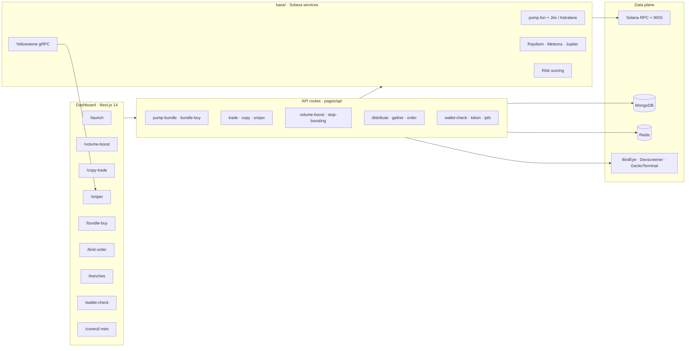

<div align="center">

# Meme Tool

**An operator dashboard for Solana meme-coin launches, bundled entries, and post-launch trading.**

Launch on pump.fun. Coordinate wallets. Snipe new pools. Mirror wallets. Run limit orders. Score counterparties. All from one Next.js control room.

[Why it wins](#-why-it-wins-vs-public-tools) · [Workflow](#-operator-workflow) · [Structure](#-architecture) · [Quick Start](#-quick-start)

<br />


`Node ≥ 20.18` · `Next.js 14` · `Solana Mainnet` · `Jito + Yellowstone gRPC`

</div>

---

## Why this exists

Meme launches on Solana move in seconds. Operators need one place to deploy, seed, trade, and monitor — not a pile of scripts.

**Meme Tool** wraps those jobs into a single dashboard:

| You need to… | The app does… |
| --- | --- |
| Ship a pump.fun token with a coordinated debut | Launchpad + bundled sniper wallets |
| Hit an existing mint from many wallets at once | Bundle Buy (up to 15 wallets) |
| Catch a new pool the moment it appears | Sniper with liquidity / MEV / DEX filters |
| Mirror a wallet you trust | Copy Trading bot |
| Buy or sell at a market-cap level | Limit Order engine (Mongo-backed) |
| Keep a campaign funded and tidy | Token Control Center (distribute / gather) |
| Inspect a counterparty before you follow them | Wallet Risk Intelligence |

---

## Why it wins vs public tools

<div align="center">
  
</div>

Most operators stitch together a Telegram sniper, a web terminal, pump.fun’s own UI, and a copy-trade bot — then pay a cut on every fill. **Meme Tool is the opposite: one self-hosted desk, full campaign lifecycle, no platform tax.**

<table>
<tr>
<td width="33%" valign="top">

### One desk, not five tabs

Photon, BullX, Axiom, GMGN, and Telegram bots each do a slice. This app is launch, bundle, snipe, copy, limits, volume, trenches, and risk — same sidebar, same wallet context.

</td>
<td width="33%" valign="top">

### You own the stack

Public bots custody keys and skim 0.5–1%+ per trade. Here the app runs on **your** RPC, Mongo, and Redis. Volume plans list a **0% platform fee**. Keys are AES-encrypted before they leave the browser.

</td>
<td width="33%" valign="top">

### Campaign, not just a swap

pump.fun and most terminals stop at create / buy / sell. The Control Center generates wallets, distributes SOL and tokens, recalls funds, and keeps charts in one mint-scoped cockpit.

</td>
</tr>
</table>

### Head-to-head

| Capability | Typical public tools | **Meme Tool** |
| --- | :---: | :---: |
| Surface | Telegram bot **or** web terminal **or** launchpad | **All eight** operator surfaces in one UI |
| Custody | Import keys into a third-party bot | **Self-hosted** · AES payloads · your infra |
| Platform fee | Often 0.5–1%+ on every fill | **0%** on volume plans · you pay only RPC / Jito tips |
| Launch | Single-wallet create on pump.fun | Create **+ up to 15 bundled buyers** in one Jito / Astralane shot |
| Execution rails | One relay, public RPC polling | **Jito + Astralane** toggle · **Yellowstone gRPC** stream |
| Copy trade | Follow wallet, hope the PnL is real | Mirror fills **and** score the target first |
| Risk intel | Leaderboard / PnL screenshot | Feature score: tx rate, fail %, unique peers, fee & dust patterns |
| Limit orders | Market only, or price alerts | **Market-cap triggers**, expiry, Mongo-backed `OrderCard` list |
| Post-launch ops | Manual SOL sends in a wallet app | Generate · **distribute** · **gather** from `/control/[mint]` |
| Extensibility | Black-box SaaS | Source you can fork — page → `base/` → `pages/api/` |

### What that means on a live mint

1. **Debut is coordinated.** Create the token and seed up to 15 sniper wallets in the same bundle — not “create on pump.fun, then race yourself in Photon.”
2. **Entries are not guesswork.** Sniper filters on liquidity, MEV, slippage, and socials over a gRPC stream, then lands through Jito or Astralane — not a best-effort RPC poll.
3. **You do not blindly copy.** Wallet Check breaks down *why* a trader looks toxic (burst tx/hour, high fail rate, dust hops, extreme fees) before Copy Trading attaches.
4. **The book stays open after the launch.** MC limits persist in Mongo. Volume plans start and stop without pasting raw keys. When the campaign ends, gather SOL back instead of hunting 20 burner wallets by hand.

> Public terminals are built for *traders*. This repo is built for *operators* who launch, seed, and run the full desk.

---

## Operator Workflow

<div align="center">
  
</div>

One mint, one desk, six steps:

| Step | Surface | What happens |
| --- | --- | --- |
| **1 · Launch** | `/launch` | Name, ticker, art, socials → pump.fun create |
| **2 · Bundle** | `PumpBundleModal` | Seed up to 15 wallets in one Jito or Astralane shot |
| **3 · Control** | `/control/[mint]` | Generate wallets, distribute SOL, watch the chart |
| **4 · Trade** | Sniper · Copy · Limits · Volume | Entries, mirrors, MC brackets, volume plans |
| **5 · Score** | `/wallet-check` | Feature-level risk before you follow a wallet |
| **6 · Gather** | Control Center | Recall SOL and tokens when the campaign ends |

---

## Command Center

Eight operator surfaces, one sidebar.

<table>
<tr>
<td width="50%" valign="top">

### Launch
**`/launch`**

Create a pump.fun token with name, ticker, artwork, and socials. Upload creative assets, attach website / X / Telegram / Discord, then provision sniper wallets through `PumpBundleModal`. Bundle buys and initial liquidity go out server-side so the debut is consistent.

</td>
<td width="50%" valign="top">

### Volume Boost
**`/volume-boost`**

Four intensity plans (wallet count, TPS, delay). Execution payloads are AES-encrypted before they hit `/api/volume-boost`. Start, stop, and gather SOL without shipping raw keys in the clear.

</td>
</tr>
<tr>
<td width="50%" valign="top">

### Copy Trading
**`/copy-trade`**

Point a bot wallet at a target address. Trades are mirrored through `/api/copy` on the same routing path as manual swaps.

</td>
<td width="50%" valign="top">

### Sniper
**`/sniper`**

Stream new pools over Yellowstone gRPC. Filter on liquidity, MEV protection, slippage, supported DEXes, and social signals. Qualifying entries go out as Jito-enabled transactions.

</td>
</tr>
<tr>
<td width="50%" valign="top">

### Bundle Buys
**`/bundle-buy`**

Submit up to 15 managed wallets, decode secret keys, and fire synchronized buys against an existing mint. Live balances, validation, and toast feedback keep the desk honest.

</td>
<td width="50%" valign="top">

### Limit Orders
**`/limit-order`**

Buy or sell brackets with market-cap triggers, expiry windows, and size thresholds. Orders persist in MongoDB and render back through `OrderCard`.

</td>
</tr>
<tr>
<td width="50%" valign="top">

### Trenches
**`/trenches`**

A radar for fresh pump.fun and Raydium liquidity — new pairs, graduating pools, and post-graduate momentum in one feed.

</td>
<td width="50%" valign="top">

### Wallet Check
**`/wallet-check`**

Score a counterparty before you follow them. SOL + SPL portfolio, scraped trader leaderboards, and a feature-level risk breakdown from `/api/wallet-check`.

</td>
</tr>
</table>

### Token Control Center

**`/control/[mint]`** is the campaign cockpit after launch:

- Wallet balances and token metadata
- TradingView / GMGN charts
- Generate burner wallets
- Distribute SOL and tokens
- Recall funds when the campaign is done

---

## Architecture

<div align="center">
  
</div>

Four layers, one path: the dashboard talks to API routes, APIs call `base/` Solana services, and those services hit RPC, Mongo, Redis, and market data.



| Layer | What lives there |
| --- | --- |
| **Frontend** | Next.js 14 pages router, HeroUI, Tailwind, Framer Motion, Zustand |
| **APIs** | `pages/api/*` — Solana RPC, Jito bundles, Mongo persistence, Redis cache, market data |
| **Base services** | `base/` — wallets, pump.fun SDK, bundling, sniper streams, liquidity, risk scoring |
| **Providers** | Wallet adapters (Phantom, Solflare, Torus, Ledger), theme, volume session |
| **Data** | MongoDB (orders, tokens, wallet groups) · Redis (cache / coordination) |

---

## Tech Stack

```
Frontend          Next.js 14 · React 18 · TypeScript · Tailwind · HeroUI · Framer Motion
State             Zustand · React Context (wallet, theme, volume)
Wallets           Phantom · Solflare · Torus · Ledger
Solana            web3.js · Anchor 0.30 · SPL Token · Metaplex
DEX / launch      pump.fun · Raydium SDK v1/v2 · Meteora Dynamic AMM · Jupiter
Execution         Jito bundles · Astralane · Yellowstone gRPC
Data              MongoDB / Mongoose · Redis
Market intel      BirdEye · Dexscreener · GeckoTerminal · TradingView / GMGN
```

---

## Quick Start

**Requirements:** Node.js `≥ 20.18`, Yarn, a Solana RPC + WSS endpoint, MongoDB, Redis.

```bash
# 1. Install
yarn install

# 2. Configure
cp ".env copy" .env.local
# fill in RPC, gRPC, Mongo, Redis, and API keys

# 3. Develop
yarn dev
```

Open [http://localhost:3000](http://localhost:3000).

```bash
yarn build          # production build
yarn start          # serve on port 3001
yarn lint           # ESLint
yarn test           # TypeScript harness in test.mts
```

The dev and start scripts raise the Node heap to 8 GB (`--max-old-space-size=8192`) so sniper and volume workloads do not OOM.

---

## Environment

Copy `.env copy` to `.env.local`. Next.js loads it automatically.

### Required

| Variable | Role |
| --- | --- |
| `NEXT_PUBLIC_MAIN_RPC` | Primary Solana HTTP RPC |
| `NEXT_PUBLIC_MAIN_WSS` | Primary Solana WebSocket |
| `NEXT_PUBLIC_GRPC` | Yellowstone gRPC endpoint |
| `NEXT_PUBLIC_GRPC_TOKEN` | Yellowstone access token |
| `NEXT_PUBLIC_MONGODB_URL` | MongoDB connection string |
| `NEXT_PUBLIC_REDIS_URI` | Redis URI for cache and task coordination |
| `NEXT_PUBLIC_ENCRYPT_KEY` | AES key for private keys and wallet arrays |
| `NEXT_PUBLIC_BIRD_EYE_API` | BirdEye key for prices and wallet analytics |
| `NEXT_PUBLIC_ASTRALANE_KEY` | Astralane key for Jito bundle orchestration |
| `NEXT_PUBLIC_JITO_UUID` | Jito block-engine UUID |

### Sniper / liquidity toggles

| Variable | Default | Role |
| --- | --- | --- |
| `CHECK_IF_MINT_IS_RENOUNCED` | `false` | Require mint authority revoked |
| `CHECK_IF_MINT_IS_MUTABLE` | `false` | Reject mutable metadata |
| `CHECK_IF_MINT_IS_BURNED` | `false` | Require LP burn |
| `WAIT_UNTIL_LP_IS_BURNT` | `true` | Hold until LP is burned |
| `LP_BURN_WAIT_TIME` | `900` | Seconds to wait for LP burn |
| `AMOUNT_TO_WSOL` | `0.002` | WSOL wrap amount |
| `MAX_RETRY` | `10` | Transaction retry budget |
| `FREEZE_AUTHORITY` | `true` | Freeze-authority policy |

> **Never commit `.env.local`.** The UI encrypts private keys before they reach API routes. You still own storage, runtime secrets, and infrastructure hygiene.

---

## Project Map

```
meme-tool/
├── pages/
│   ├── launch/              Token creation + bundle modal
│   ├── volume-boost/        Plan picker + encrypted runner
│   ├── copy-trade/          Mirror a target wallet
│   ├── sniper/              Pool stream + Jito entry
│   ├── bundle-buy/          Multi-wallet synchronized buys
│   ├── limit-order/         MC triggers + expiry
│   ├── trenches/            New-pair radar
│   ├── wallet-check/        Risk score + portfolio
│   ├── control/[payload]    Campaign cockpit
│   └── api/                 16 orchestration routes
├── base/
│   ├── pump/                pump.fun SDK, Jito, Astralane
│   ├── volume/              Boost, distribute, gather
│   ├── liquidity/           AMM helpers
│   ├── market/              Market + orderbook
│   ├── sniper.ts            Stream + entry
│   ├── copyTrade.ts         Mirror execution
│   └── wallet-check/        Feature scoring
├── components/              TradePanel, TokenCard, OrderCard, layout
├── providers/               Wallet, theme, volume, app
├── store/                   Zustand slices
├── models/                  Token, Order, WalletGroup (Mongoose)
└── lib/                     Constants, types, Redis, formatters
```

### API surface

| Route | Job |
| --- | --- |
| `/api/pump-bundle` | Coordinated pump.fun launch + buys |
| `/api/bundle-buy` | Synchronized multi-wallet buys |
| `/api/sniper` | Stream filters → Jito entry |
| `/api/copy` | Mirror target-wallet trades |
| `/api/limit-order` · `/api/order` | Create and list MC-triggered orders |
| `/api/volume-boost` · `/api/stop-boosting` | Start / stop volume plans |
| `/api/distribute` · `/api/gather` · `/api/gather-sol` | Fund and recall wallets |
| `/api/trade` | Manual swap path |
| `/api/token` | Tokens owned by a keypair |
| `/api/ipfs-upload` | Creative asset upload |
| `/api/wallet-check` · `/api/scrapping` | Risk score + trader scrape |

---

## Operating Notes

**Wallets.** Several screens accept private keys to unlock automation. Use burners, keep balances tight, rotate often.

**RPC.** Sniper, bundler, and volume modules need a fast RPC and a live gRPC stream. Budget for a premium provider or a self-hosted node.

**Feedback.** API routes surface toasts in the UI. In production, pipe those routes into your own logs and alerts.

**Extending.** New flows follow the existing pattern: page under `pages/`, logic in `base/`, thin encrypted API in `pages/api/`.

---

## Scripts

| Command | What it does |
| --- | --- |
| `yarn dev` | Dev server with 8 GB heap |
| `yarn build` | Production build |
| `yarn start` | Serve the build on port `3001` |
| `yarn lint` | Next.js ESLint |
| `yarn test` | `ts-node test.mts` |

---

<div align="center">

**Launch. Bundle. Snipe. Monitor.**

Built for Solana operators who would rather run a desk than a folder of scripts.

</div>
